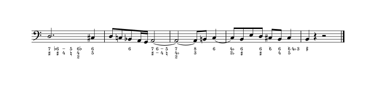

# Figurato
Figurato is a figured bass font for music notation software. It allows for easy input of multiple stacked numbers and accidentals.

## Recent changes
- Typing `|` (bar) registers an invisible opening or closing parenthesis or bracket.
- Another version of the font, FiguratoB, has been added for figured bass indications above the staff. It works in the same way as Figurato, except that the figures are vertically aligned to the bottommost row.

[Full changelog](docs/changelog.md)

## Mac users, please read this:
There is [a bug in the underlying Qt framework](https://bugreports.qt.io/browse/QTBUG-69803) that affects the automatic positioning **in Dorico on Mac.** Do be aware that if you print your score or export it as pdf the positioning of the figures will be turned upside down in the printout. This is likely to cause collisions for pretty much every figure that consists of more than one layer. Long story short: Don’t use Figurato with Dorico on Mac.

## How to use
Figurato was developed with Dorico’s lyrics popover in mind. It can be used in normal text objects and playing techniques too.  
The font works in any software that supports OpenType features (ligatures, contextual alternates, kerning), including Finale 25.

#### Characters
key | character
:---|:---
0–9,10 | numbers
n | natural  
b | flat  
\#, s | sharp  
bb | double flat  
x | double sharp  
-, –, d | dash  
, | separator
/, + | [combining slash](#slashed-numbers-and-dashes)
i | modifier for [italic numbers](#italic-numbers)

#### Layers
Figures are automatically stacked from top to bottom. If you need to skip a layer type `,`.  

#### Accidentals
By default accidentals are placed *to the right of the preceding number.* If you want an accidental to be placed to the left of the following number separate it from the preceding number with `,` unless the position is clear from the context.  

As you can see accidentals can be placed both to the left and to the right of numbers in the same figure. Just type away. If something doesn’t look like you expect your input is probably ambiguous: insert `,` to make things clear.  

If you need a single accidental separate it with `,` unless – again – the position is clear from the context.  

#### Slashed numbers and dashes
If you need a slashed number, type `/` or `+` after the number.  
If you need a dash type `-` (hyphen), `–` (endash) or `d`.  Note that typing a hyphen will advance the position during lyric input in Dorico and Finale.  

#### Parentheses and Brackets
You can put an accidental, a complete layer or even multiple layers in parentheses or brackets.  

#### Italic numbers
Numbers preceded by `i` are printed in italics.  

