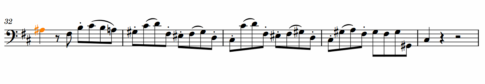

# Figurato
Figurato is a figured bass font for music notation software. It allows for easy input of multiple stacked numbers and accidentals.

<!--  -->

#### Recent changes  
- Added [FiguratoMac](docs/FiguratoMac.md), a version of the font that bypasses the OpenType bug in Dorico on Mac by using precomposed figures instead of positioning rules.

[Full changelog](docs/changelog.md)

## How to use
Figurato was developed with Dorico’s lyrics popover in mind. It can be used in normal text objects and playing techniques too.  
The font works in any software that supports OpenType features (ligatures, contextual alternates, kerning), including Finale 25.

>**Mac users, please read this:** Due to [a bug in the Qt framework](https://bugreports.qt.io/browse/QTBUG-69803) that Dorico is built upon, you can't use the normal version of the font with Dorico on Mac. **Don't use Figurato or FiguratoB with Dorico on Mac. Do use FiguratoMac instead.** For limitations and notes about portability see [here](docs/FiguratoMac.md).

#### Characters
key | character  
:---|:---
0–12 | numbers  
n | natural  
b | flat  
\#, s | sharp  
bb | double flat  
x | double sharp  
-, –, d | [dash](#slashed-numbers-and-dashes)  
, | [separator](#layers)  
( ), [ ], \| | [parentheses and brackets](#parentheses-and-brackets)
/, + | [combining slash](#slashed-numbers-and-dashes)
i | modifier for [italic numbers](#italic-numbers)

#### Layers
Figures are automatically stacked from top to bottom, following these rules:  
- Each layer/row can contain at most one number and one quality (accidental/slash).
- If a character doesn’t fit into the current row, it’s automatically placed in the next row.
- If you need to advance to the next layer although the next character would still fit into the current row, type `,`.

#### Vertical alignment
There are two versions of the font, Figurato and FiguratoB. They work identically except for the vertical alignment of the figures. In figures that are set with Figurato the topmost lines are vertically aligned, whereas with FiguratoB the bottommost lines are vertically aligned. Figurato is suited for figured bass indications below the staff, whereas FiguratoB works best for indications above the staff.  

#### Accidentals
By default accidentals are placed *to the right of the preceding number.* If you want an accidental to be placed to the left of the following number separate it from the preceding number with `,` unless the preceding row is full anyway.  

As you can see accidentals can be placed both to the left and to the right of numbers in the same figure. Just type away. If something doesn’t look like you expect your input is probably ambiguous: insert `,` to make things clear.  

If you need a single accidental separate it with `,` unless – again – the preceding row is full anyway.  

#### Slashed numbers and dashes
If you need a slashed number, type `/` or `+` after the number. Both `/` and `+` work with all slasheable numbers (2, 4, 5, 6, 7 and 9).
If you need a dash type `-` (hyphen), `–` (endash) or `d`.  Note that typing a hyphen will advance the position during lyric input in Dorico and Finale.  

#### Parentheses and Brackets
You can put an accidental, a complete layer or even multiple layers in parentheses or brackets.  
If you need to put more than one figure in parentheses you still need to input two parentheses per figure. Replace the one that you don't want to see with `|`.  

#### Italic numbers
Numbers preceded by `i` are printed in italics.  
