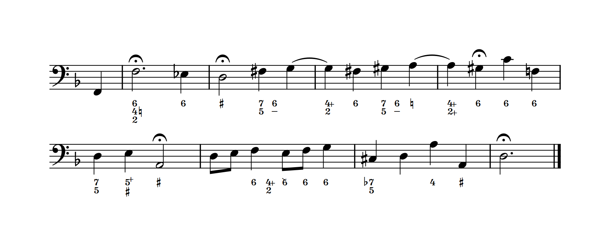

# Figurato
Figurato is a figured bass font for music notation software. It allows for easy input of multiple stacked numbers and accidentals.

## Recent changes
- The stacking order has been inverted. Figures are now automatically stacked top-down. Figures in documents that were created with a version prior to 0.3 will look different when you install the latest version.  
[Full changelog](docs/changelog.md)

## Mac users, please read this:
There is [a bug in the underlying Qt framework](https://bugreports.qt.io/browse/QTBUG-69803) that affects the automatic positioning **in Dorico on Mac.** Do be aware that if yo print your score or export it as pdf the positioning of the figures will be turned upside down in the printout. This is likely to cause collisions for pretty much every figure that consists of more than one layer. Long story short: Don’t use Figurato with Dorico on Mac.

## How to use
Figurato was developed with Dorico’s lyrics popover in mind. It can be used in normal text objects and playing techniques too.  
The font works in any software that supports OpenType features (ligatures, contextual alternates, kerning), including Finale 25.

#### Characters
key | character
:---|:---
n | natural  
b | flat  
\#, s | sharp  
bb | double flat  
x | double sharp  
/, + | combining slash
-, –, d | dash  
, | separator

#### Layers
Figures are automatically stacked from top to bottom:  
`643` is rendered as a six on top of a four on top of a three.  
If you need to skip a layer, type `,`: `b7,3`

#### Accidentals
By default accidentals are placed *to the right of the preceding number:*  
`6b4` is rendered as a six followed by a b flat, both on top of a four.

If you want an accidental to be placed to the left of the following number, separate it from the preceding number with `,`:  
In `6,b4` the bflat is placed to the left of the four instead.

You can place accidentals both to the left and to the right of numbers in one figure. Just type away. If something doesn’t look like you expect, your input is probably ambiguous: insert `,` to make things clear.

If you need a single accidental in the bottommost layer, separate it with `,`:  
`5,b` gives you a five on top of a b flat. 

#### Slashed numbers and dashes
If you need a slashed number, type `/` or `+` after the number: `6/` or `6+`

If you need a dash type `-` (hyphen), `–` (endash) or `d`. 
Note that typing a hyphen will advance the position during lyric input in Dorico and Finale.

#### Parentheses and Brackets
There’s limited support for parentheses and brackets. You can put one or more layers in parentheses or brackets: `(4)` `[63]` `6(42)` This does not reliably work with accidentals yet.

#### Italic numbers
Numbers preceded by `i` are printed in italics: `6i4i2`
