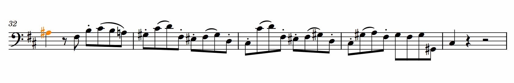

## Figurato

### How to use Figurato in Dorico

**[Mac users please read this!!](FiguratoMac.md)**

It is possible to almost get the impression of a native figured bass feature when you use Figurato with the lyrics popover. In fact, Figurato was specifically developed for this way to use it.  

  

We need to hijack one of the lyrics font styles for figured bass. Since Dorico comes with four built-in font styles for different types of lyrics *(Lyrics, Lyrics Translation, Chorus Lyrics and Chorus Lyrics Translation),* chances are that you won’t be needing all of them even if there are real lyrics in your project.

1. Switch to **Engrave Mode** and go to **Engrave > Font Styles,** pick a lyric style that you don’t need elsewhere and set its font to Figurato. For the font size I recommend something around 10 pt. (If you’ve got a score and parts with largely varying staff sizes it may be worth checking out whether a fixed size that’s independent from the actual staff size allows for better legibility in the score.)  
2. Select a note in your continuo part, invoke the lyrics popover and choose the  lyric type according to the font style you configured for Figurato earlier (use **Up** and **Down Arrow** to switch between chorus and normal verses, hold down **Alt** and press **Up** or **Down Arrow** to switch between regular and translation lyrics).  Now just type away.  
3. Depending on the font size you you may want to select all figures at once after inputting them and activate the **Lyric Text Alignment property.** It will automatically be set to left which gives better result in most cases.

#### A few tips to help  you with common road blocks:

- Don’t press **Space** to advance to the next note lest Dorico add extension lines to your ‘lyrics’. Press **Right Arrow** instead.   
- Don’t bother about unnecessary extension lines below tied notes until you’ve input all of your figures. Then select all figures at once (using **Select More** or a filter), switch to **Engrave Mode,** open the **Properties Panel,** activate the **Line End X property** and set it to a high negative value. Thus you can get rid of all the extension lines at once.  
- You’ll sometimes need multiple figures below a single sustained bass note. This is a bit awkward. I recommend that you first input one bass note at each rhythmic position where there’s a figured bass indication. Then add the numbers and combine the individual notes by tieing them together afterwards.  
Another method for this would be to exit lyric input, activate the caret by pressing **Shift-N,** advance it to the next figure position with the arrow keys and reinvoke the lyrics popover. This is even less comfortable though because you’ll probably need to switch to the correct lyric type again.  
- As of now Dorico does not allow us to move indivdual lyric syllables up or down. I therefore tend to use generic text objects for figures above or below notes that reach far out of the system. It’s equally possible to use playing techniques for this.  
- It’s not really feasible to use Dorico’s lyric extension lines for figured bass with Figurato. You can mimick extension lines with dashes and spaces from inside the font, but this is complicated and requires a fair amount of trial and error (refer to the [main manual](manual.md#special-characters) for an example – note that you’d need to input non-breaking spaces (**Alt-Shift-Space**) in the lyrics popover for this).

[Back to the main manual](manual.md)