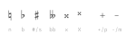
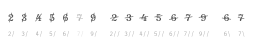
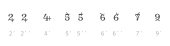
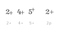
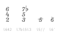
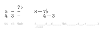
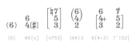
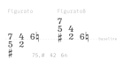

## Figurato

### How to use

Figurato automatically detects the individual rows of a figured bass indication and positions all symbols accordingly. You do not need to type carriage returns. Figures are automatically stacked from top to bottom, following these rules:  
- Each row can contain at most one number and one quality indication (i.e. either one number and one accidental, or one modified number).
- If a character doesn’t fit into the current row it’s automatically placed in the next row.
- If you need to advance to the next row although the next character would still fit into the current row type `,`.

#### Special characters
_Accidentals_  
Self-explanatory. Double flat is built as a ligature of two `b`s. Type uppercase `X` for a superscript x.

_Modified numbers_  
Numbers with additional elements that indicate an alteration are accessible as ligatures.

There are two sets of slashed numbers. The numbers in the first set are dashed rather steeply, with individual angles. In the second set the slope of the dashes is the same for all numbers.  

There are also numbers with tiny slashes that cross only one part of the glyph (alternate versions for 2, 5 and 6).

2, 4 and 5 can unite with +. If you don’t want any of these ligatures type `p` instead of `+`.  

_Italic figures_  
Italic variants of all numbers and modified numbers are accessible as ligatures with a preceding `i`. Accidentals cannot be set in italics.  

_Dashes and spaces_  
Type `d` or `–` (endash!) for a horizontal dash. Each row can only contain one dash and nothing else. Together with the space character they can also be used to mimick extension lines if the notation software does not offer a tool to draw generic lines. (Note that all characters in Figurato except for the space character have zero width.)  

#### Parentheses and Brackets
You can put an accidental, a complete row or even multiple rows in parentheses or brackets.  
If you need to put more than one figure in parentheses you still need to input two parentheses per figure. Replace the one that you don't want to see with `|`.  

#### Vertical alignment
There are two versions of the font, Figurato and FiguratoB. They work identically except for the vertical alignment of the figures. In figures that are set with Figurato the topmost lines are vertically aligned, whereas with FiguratoB the bottommost lines are vertically aligned. Figurato is suited for figured bass indications below the staff, whereas FiguratoB works best for indications above the staff.  
