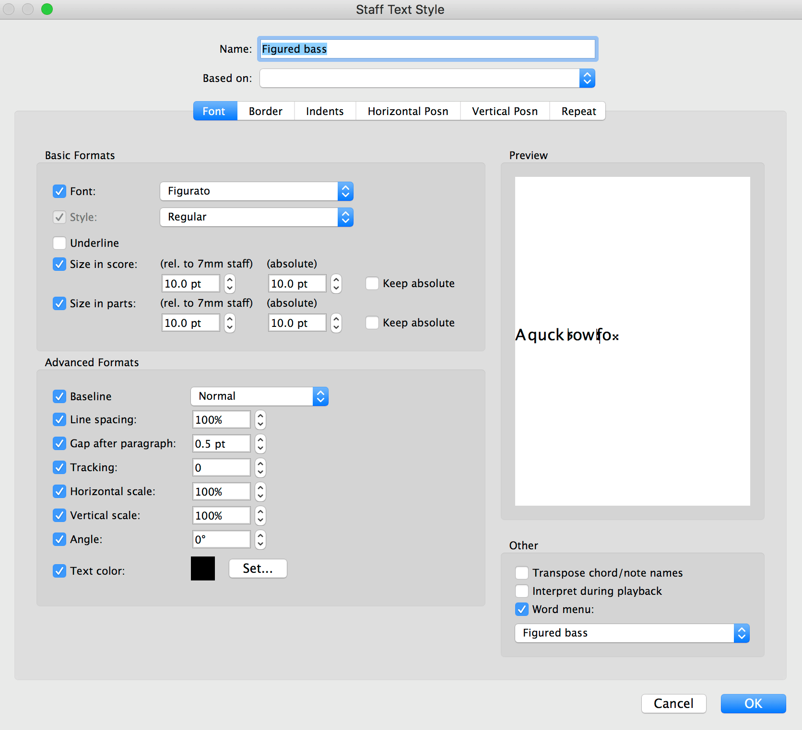
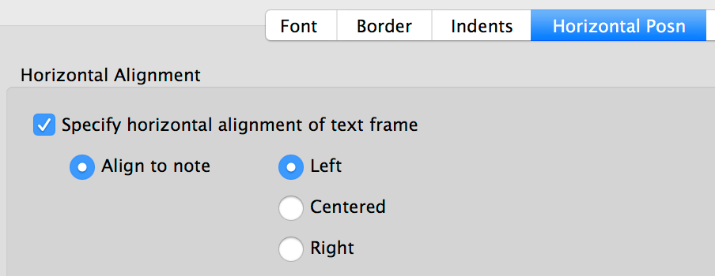
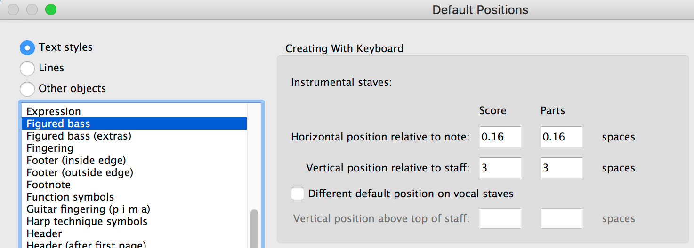

## Figurato

[Figurato](../README.md) > [Manual](manual.md) > Sibelius

### How to use Figurato in Sibelius

#### Easiest: Import the Norfolk house style  

The easiest way to use Figurato in Sibelius is to import the latest Norfolk house style. Be advised, though, that importing the Norfolk house style will change other settings in your score, so you may wish to customize your document to use Figurato instead. See below.  

Figurato and Norfolk are bundled with the Norfolk fonts, which are available from [NYC Music Services.](https://www.nycmusicservices.com/musicresources/#fonts-sibelius) Instructions for adding the house style to your computer can be found in the Norfolk documentation.  

Once you have imported the Norfolk house style into your document, use the **Figured bass text style** to create figured bass notation with Figurato.

#### Custom: Manually adjust settings in Sibelius  

If you do not wish to import the Norfolk house style, you can customize your document to use Figurato without changing other settings in your score.  

In **Text > Styles > Edit Text Styles**, select **Figured bass** and click **Edit…**  

In the Font tab, use the following settings:  

  

The relevant settings to change from Sibelius's defaults are:  
- Font: Figurato
- Line spacing: 100%  

You may need to change other settings if you've altered them previously in your document.

In the **Horizontal Posn** tab, choose **Specify horizontal alignment of text frame > Align to note > Left**.  

  

Click **OK,** then **Close.**  

Next, in **Appearance > Design and Position > Default Positions**, select **Text styles > Figured bass**, and use the following settings:

  

The relevant settings to change from Sibelius's defaults are:  
- Horizontal position relative to note in Score and Parts: 0.16 spaces
- Vertical position relative to staff in Score and Parts: 3 spaces

Click **OK.**

You can now use the **Figured bass text style** to input figured bass by following the instructions in the [main section of the Figurato manual.](manual.md)

#### Using Figurato in place of Opus Figured Bass

Figurato employs a system of generating figured bass notation that is completely different from the Opus Figured Bass font. As such, figured bass already entered using Opus Figured Bass will not automatically convert once Figurato is applied, and the notation will have to be manually re-entered.  

Should you wish to retain the ability to use both Opus Figured Bass and Figurato in your document, you could leave the existing **Figured bass text style** alone and create a new text style, called e.g., **Figured bass - Figurato**, and use the above settings in your new text style.  

The word menu for the **Figured bass text style** (accessed by right-clicking or Control-clicking on Mac), will not be applicable to the Figurato font, though you can modify the word menu or create a new one if you wish (see the **Sibelius Reference, 5.1 Working with text.**)  

_Many thanks to Philip Rothman from [NYC Music Services](https://www.nycmusicservices.com) for providing the instructions on this page._

[Back to the top](sibelius.md#figurato)